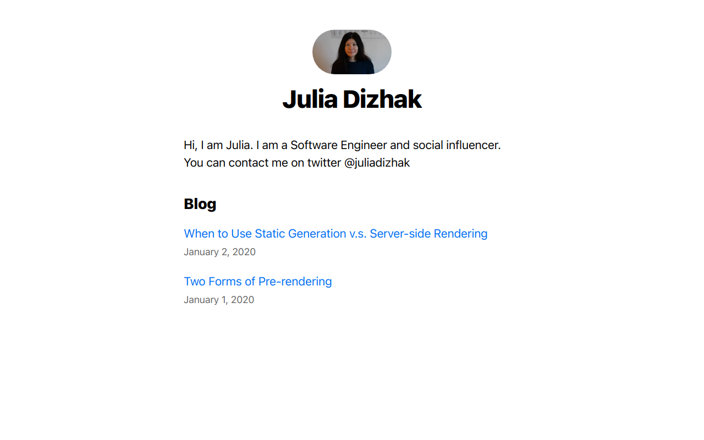

# Build a blog using Next.js

Here is a simple blog built using Next.js, JavaScript, CSS, HTML, React.

### Design
Here is how the design look like for desktop and mobile

 The project is available on link [Blog](https://nextjs-blog-taupe-mu.vercel.app/).

## To run locally

Open a new terminal window, and navigate to the folder.
Run `npm install & npm run dev`. 
This will install all packages and start the blog in localhost:3000.

## Features
- render posts content using static generation method from Next.js
- load posts from markdown 
- dynamic routes

## Deploy

Deployed by Vercel